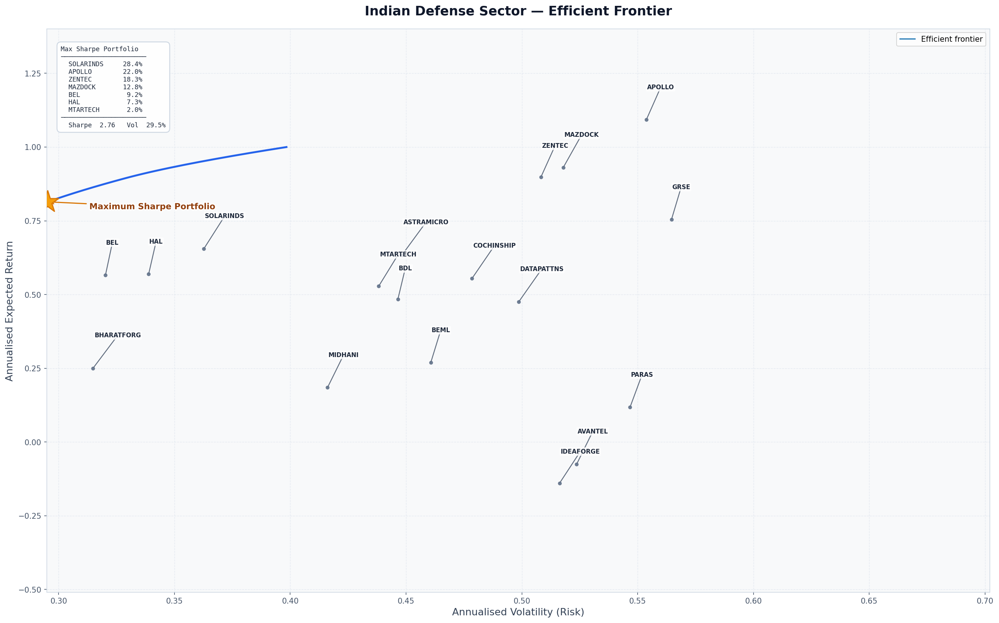

# Indian Defense Sector Quantitative Portfolio Optimizer

A **Markowitz mean-variance optimizer** for the Indian Defense & Aerospace equity universe, built with Python and [PyPortfolioOpt](https://pyportfolioopt.readthedocs.io/).

---

## What it does

1. **Data ingestion** — pulls up to 5 years of daily adjusted-close prices for 18 NSE-listed defense and aerospace stocks via `yfinance`.
2. **Data cleaning** — drops rows where *all* tickers are missing (handles thin early history for recent IPOs like IdeaForge and Paras Defence), then forward-fills remaining gaps so the covariance matrix stays well-conditioned.
3. **Return & risk estimation** — computes annualised mean historical returns and the sample covariance matrix using PyPortfolioOpt's built-in estimators.
4. **Portfolio optimisation** — solves for the **Maximum Sharpe Ratio** portfolio with weights bounded to [0%, 100%], allowing the algorithm to zero-out underperformers entirely.
5. **Output**
   - Prints cleaned percentage weights and performance metrics (return, volatility, Sharpe) to the terminal.
   - Plots the **Efficient Frontier** and saves it as `defense_frontier.png`.

---

## Universe (18 stocks)

| Ticker | Company |
|---|---|
| HAL.NS | Hindustan Aeronautics Ltd |
| BEL.NS | Bharat Electronics Ltd |
| MAZDOCK.NS | Mazagon Dock Shipbuilders |
| COCHINSHIP.NS | Cochin Shipyard |
| BDL.NS | Bharat Dynamics Ltd |
| SOLARINDS.NS | Solar Industries India |
| BHARATFORG.NS | Bharat Forge |
| BEML.NS | BEML Ltd |
| GRSE.NS | Garden Reach Shipbuilders & Engineers |
| MIDHANI.NS | Mishra Dhatu Nigam |
| DATAPATTNS.NS | Data Patterns (India) |
| ZENTEC.NS | Zen Technologies |
| AVANTEL.NS | Avantel Ltd |
| APOLLO.NS | Apollo Micro Systems |
| PARAS.NS | Paras Defence & Space Technologies |
| MTARTECH.NS | MTAR Technologies |
| ASTRAMICRO.NS | Astra Microwave Products |
| IDEAFORGE.NS | ideaForge Technology |

---

## Requirements

```
yfinance
pypfopt          # PyPortfolioOpt
matplotlib
numpy
adjustText
```

Install with:

```bash
pip install yfinance pyportfolioopt matplotlib numpy adjustText
```

---

## Usage

```bash
python defense_optimizer.py
```

The script will:
- Print the optimal portfolio weights to the console.
- Display and save the efficient frontier plot as `defense_frontier.png`.

---

## Methodology

This optimizer implements **Modern Portfolio Theory (Markowitz, 1952)**:

- **Expected returns**: arithmetic mean of historical daily log-returns, annualised by ×252.
- **Covariance matrix**: sample covariance of daily log-returns, annualised by ×252.
- **Objective**: maximise the **Sharpe Ratio** (return per unit of risk), assuming a risk-free rate of 0%.
- **Constraints**: long-only (no short-selling), fully-invested (weights sum to 1).

> **Disclaimer**: This tool is for educational and research purposes only. Past performance does not guarantee future results. Not financial advice.

---

## Output example

```
--- Maximum Sharpe Ratio Portfolio Weights ---
  SOLARINDS.NS       28.36%
  APOLLO.NS          22.00%
  ZENTEC.NS          18.30%
  MAZDOCK.NS         12.85%
  BEL.NS              9.23%
  HAL.NS              7.26%
  MTARTECH.NS         2.01%

Expected annual return: 81.4%
Annual volatility: 29.5%
Sharpe Ratio: 2.76
```

## Efficient Frontier



> Each stock is labeled directly on the chart with a leader line pointing to its exact (volatility, return) coordinate. The golden star marks the Maximum Sharpe Portfolio. The inset legend shows the full allocation breakdown.
